# Using the CLI Wallet

## Screenshots

Here's a quick screenshot of the CLI Wallet in action-

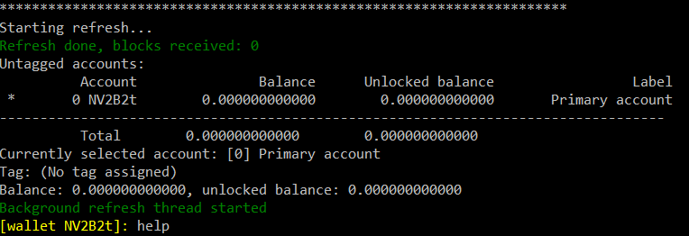

## Downloading

Binary distributions can be found [here](https://getnerva.org/#downloads).

Select the appropriate file for the target platform (Windows, Ubuntu, Fedora, Debian).

## Installing

Extract the `.zip` file to a directory of your choice

## Synchronizing the Blockchain

Run `nervad(.exe)`. It will now start syncing with the network.

(if your AV or Firewall pops up, tell it to allow/trust the program)

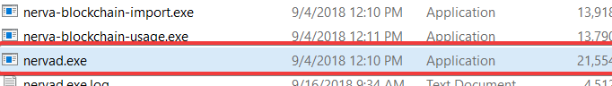

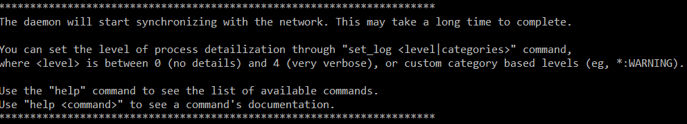

* You can see how much you've synced and how you have to go with the command `status`. In this example, I have fully synced with the network.

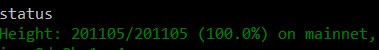

## Using the CLI Wallet

With `nervad(.exe)` still running, run `nerva-wallet-cli(.exe)`

### Creating a Wallet

In the running CLI wallet client,

* enter a name(for example, `nerva`)

* press `Y` or `Yes` to generate a wallet of that name

* Enter a strong password which you'd like to encrypt your wallet with, and confirm it.

* Enter the number corresponding to what language you'd like your 25 word mnemonic seed to be in(for most of you, it will be `1` - English)

  Your wallet is now created, and should begin checking the blockchain for any transactions.

### Opening a Wallet

When opening the wallet, it will prompt you for a wallet name.

* Enter the name of the wallet you had set when it was created.

* Enter the password you entered when you created the wallet.

  Your wallet should now open(make sure the daemon is open and synced) and begin checking the blockchain for any transactions.

### Viewing Wallet Address

To view your wallet address after opening wallet, in the running CLI wallet client,

* type `address`

* your wallet address will appear, after a `0`

### Exporting Keys

Each NERVA wallet is, essentially, just a string of 25 words from which the public address is derived.  
It is **very** important to export these keys and back them up somewhere that is safe and secure (meaning somewhere reliable/permanent that no one else can access).

In the event of a lost or corrupted wallet file, computer crash, etc., the *25 word mnemonic seed* and *Private Spend Key* are the **only way** to restore a wallet and recover the funds it holds.

**DO NOT SHARE IT WITH ANYONE**. **Anyone who has these can *access your funds* and has *complete control* over your wallet.**

In the running CLI wallet, 

* type `seed`  
* enter your password  
* the 25 word mnemonic seed will appear below the paragraph in green  
* **safely save and store these words**

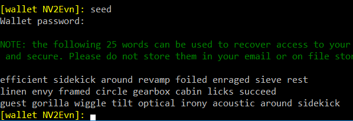

* type `spendkey`

* enter your password

* the private & public spendkey will appear

* **safely save and store this string**

  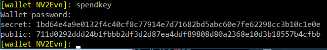


### Viewing Wallet Balance

In the running CLI wallet, 

* type `balance` to view your current balance

* `unlocked balance` is how much you can currently spend; `balance` is just how much you have. It will become unlocked generally after a few minutes.

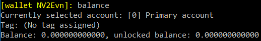

### Sending NERVA Transactions

In the running CLI wallet client,

* type `transfer default <address> <amount> <payment id>`

    * replace `<address>` with the destination address
    * replace `<amount>` with how much you want to send
    * (optional) replace `<payment id>` with the payment id given.   
    Note that usually the receiver will generate the payment id - if none is given, then you don't need it.  
    *If a payment id is provided, you **must** give it, otherwise you risk losing your funds!*

* enter your password

* If a payment ID is not given, it will confirm(press `y`/`n` to confirm/decline) - this is your last chance if you were provided one!
  
* review the transaction info again, and if all matches up, press `y`
  
* press enter

  Your transaction should now be on the way to the recipient's wallet!

For example:

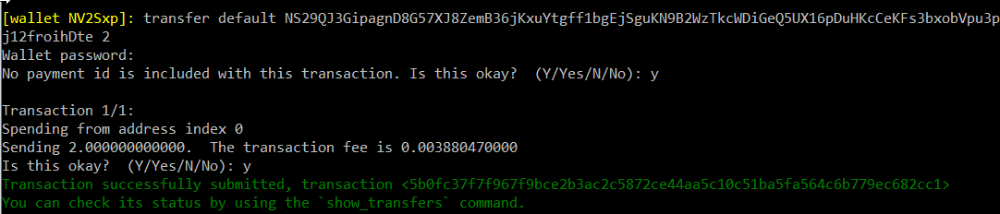

### Exiting the Wallet

'Live' wallets loaded into the CLI wallet client must be synced with the blockchain in order to properly calculate balance, view transaction history, etc. 

It is important to properly save the wallet data before exiting it so that the synchronized data is not lost.

To save a wallet's data and exit, in the running CLI wallet client, with an open wallet, 

* type `save` and press enter
* you may now type `exit` or close the window

## Restoring your Wallet

### 25 Word Mnemonic Seed

* Navigate to where your CLI wallet is located
* Open the terminal in that area

In windows, this can easily be done by typing in `cmd` in the address bar in File Explorer

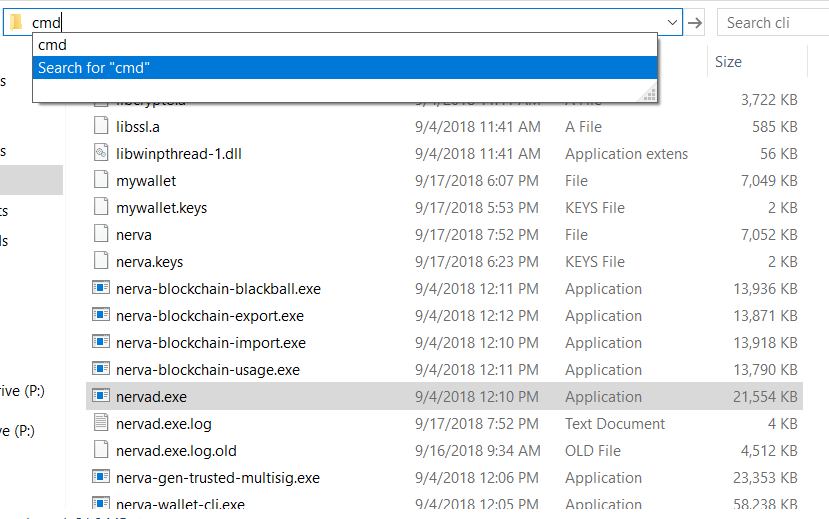

* type `nerva-wallet-cli --restore-deterministic-wallet`

* Set a name for your new wallet(for example, `nerva`)

* Enter your 25 word seed

* enter the seed encryption passphrase if one has been set; for most, it should be no

* Enter a strong password which you'd like to encrypt your wallet with, and confirm it.

* Enter a block height you'd like to scan from; if you're not sure, just press enter


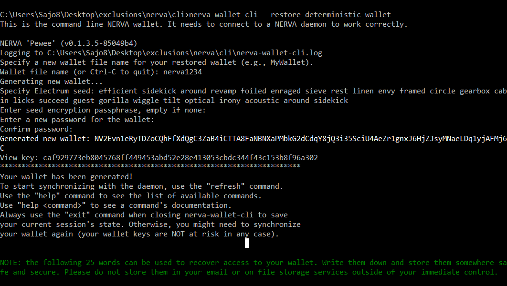

* It should return with a message similar to `Generated new wallet...`

* In case you haven't already, open `nervad` so that the wallet can sync with the network.

Congratulations! You've successfully recovered your wallet with your 25 word seed.


### Private Spend Key

* Navigate to where your CLI wallet is located
* Open the terminal in that area

In windows, this can easily be done by typing in `cmd` in the address bar in File Explorer


* Type `nerva-wallet-cli --generate-from-spend-key <spend key>`

* Replace `<spend key>` with your own (secret) spend key. For example,
  
```
nerva-wallet-cli --generate-from-spend-key 1bd64e4a9e0132f4c40cf8c77914e7d71682bd5abc60e7fe62298cc3b10c1e0e
```

* Enter your private spend key again

* Enter a strong password which you'd like to encrypt your wallet with, and confirm it.

* Enter the number corresponding to what language you'd like your 25 word mnemonic seed to be in(for most of you, it will be `1` - English)

* Enter a block height you'd like to scan from; if you're not sure, just press enter

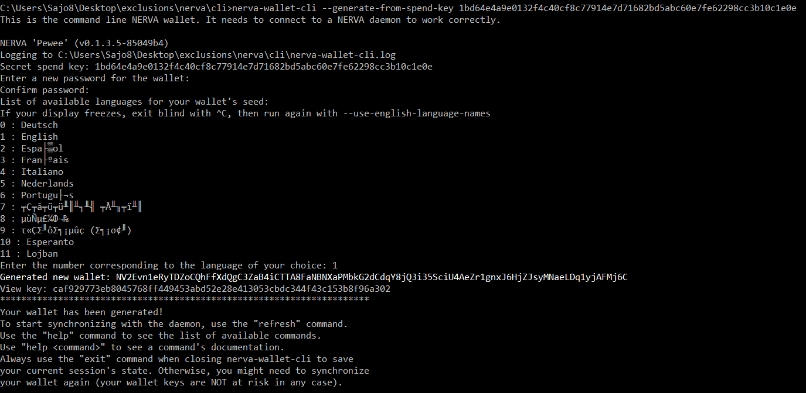

* It should return with a message similar to `Generated new wallet`

* In case you haven't already, open `nervad` so that the wallet can sync with the network.

Congratulations! You've successfully recovered your wallet with your private spend key!

## Help

You can always type `help` to see a list of commands.

```
Commands:
  account
    account new <label text with white spaces allowed>
    account switch <index>
    account label <index> <label text with white spaces allowed>
    account tag <tag_name> <account_index_1> [<account_index_2> ...]
    account untag <account_index_1> [<account_index_2> ...]
    account tag_description <tag_name> <description>
  address [ new <label text with white spaces allowed> | all | <index_min> [<index_max>] | label <index> <label text with white spaces allowed>]
  address_book [(add ((<address> [pid <id>])|<integrated address>) [<description possibly with whitespaces>])|(delete <index>)]
  balance [detail]
  bc_height
  blackball <output public key> | <filename> [add]
  blackballed <output public key>
  check_reserve_proof <address> <signature_file> [<message>]
  check_spend_proof <txid> <signature_file> [<message>]
  check_tx_key <txid> <txkey> <address>
  check_tx_proof <txid> <address> <signature_file> [<message>]
  donate [index=<N1>[,<N2>,...]] [<priority>] <amount> [<payment_id>]
  encrypted_seed
  export_key_images <file>
  export_multisig_info <filename>
  export_outputs <file>
  export_raw_multisig_tx <filename>
  fee
  finalize_multisig <string> [<string>...]
  get_description
  get_reserve_proof (all|<amount>) [<message>]
  get_spend_proof <txid> [<message>]
  get_tx_key <txid>
  get_tx_note <txid>
  get_tx_proof <txid> <address> [<message>]
  help [<command>]
  import_key_images <file>
  import_multisig_info <filename> [<filename>...]
  import_outputs <file>
  incoming_transfers [available|unavailable] [verbose] [index=<N1>[,<N2>[,...]]]
  integrated_address [<payment_id> | <address>]
  locked_transfer [index=<N1>[,<N2>,...]] [<priority>] <addr> <amount> <lockblocks> [<payment_id>]
  make_multisig <threshold> <string1> [<string>...]
  password
  payment_id
  payments <PID_1> [<PID_2> ... <PID_N>]
  prepare_multisig
  print_ring <key_image> | <txid>
  refresh
  rescan_bc
  rescan_spent
  save
  save_bc
  save_known_rings
  save_watch_only
  seed
  set <option> [<value>]
  set_daemon <host>[:<port>]
  set_description [free text note]
  set_log <level>|{+,-,}<categories>
  set_ring <key_image> absolute|relative <index> [<index>...]
  set_tx_note <txid> [free text note]
  show_transfer <txid>
  show_transfers [in|out|pending|failed|pool|coinbase] [index=<N1>[,<N2>,...]] [<min_height> [<max_height>]]
  sign <file>
  sign_multisig <filename>
  sign_transfer <file>
  spendkey
  start_mining [<number_of_threads>] [bg_mining] [ignore_battery]
  status
  stop_mining
  submit_multisig <filename>
  submit_transfer
  sweep_all [index=<N1>[,<N2>,...]] [<priority>] <address> [<payment_id>]
  sweep_below <amount_threshold> [index=<N1>[,<N2>,...]] [<priority>] <address> [<payment_id>]
  sweep_single [<priority>] <key_image> <address> [<payment_id>]
  transfer [index=<N1>[,<N2>,...]] [<priority>] <address> <amount> [<payment_id>]
  unblackball <output public key>
  unspent_outputs [index=<N1>[,<N2>,...]] [<min_amount> [<max_amount>]]
  verify <filename> <address> <signature>
  viewkey
  wallet_info
```


​    

