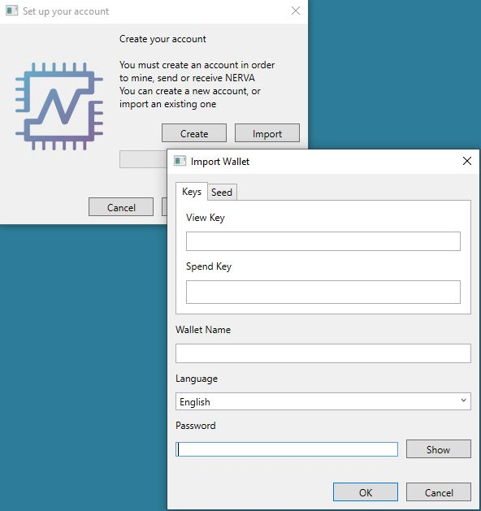
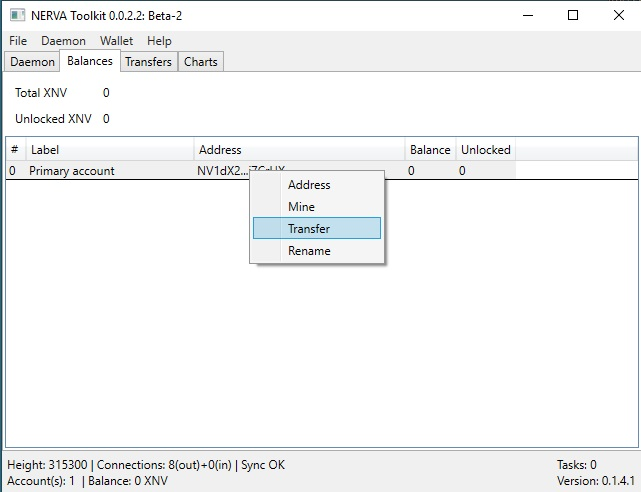

# Using the GUI Wallet

## Screenshots

Here's a quick screenshot of the GUI Wallet in action-
Please remember that the GUI is still a Beta version.

## Downloading

Binary distributions can be found [here](https://getnerva.org/#downloads).

Select the appropriate file for the target platform (Windows, Ubuntu, Fedora, Debian).

## Installing

Your system must have at least .net Framwork 4.7.1 installed. You can download it directly from Microsoft.
(https://dotnet.microsoft.com/download/dotnet-framework-runtime)

Extract the .zip file to a directory of your choice.

Make sure the path contains no space. This can lead to problems.

The unpacked files also contain the file "AngryWasp.Serializer.Serializers.dll".

Right click on this file, select properties and check the box that says "Unblock" at the bottom of the properties dialog.

## Starting up the GUI Wallet for the first time

Run Nerva.Toolkit(.exe). It will open an installation wizard.

The wizard will ask you to download the CLI tools. Click on “Download”

## Creating a Wallet / Restoring a Wallet

After the CLI tools are downloaded, you can create a new wallet or import an existing one.

   

Choose a name and a password for you wallet and click next.

After the GUI has finished creating the wallet, click “Finish”

The GUI should now open up and start syncing.

## Opening a Wallet

Click “Wallet – Select” to open your newly created/imported wallet.

In the following dialogue you can open an existing wallet, create a new one or import another one.

We want to open the wallet we created during the installation.

After that, the line „OFFLINE“ in the bottom left corner of the GUI should change to „Account(s):1“

## Exporting Keys

Each NERVA wallet is, essentially, just a string of 25 words from which the public address is derived.

It is **very** important to export these keys and back them up somewhere that is safe and secure (meaning somewhere reliable/permanent that no one else can access).

In the event of a lost or corrupted wallet file, computer crash, etc., the 25 word mnemonic seed and Private Spend Key are the **only way** to restore a wallet and recover the funds it holds.

**DO NOT SHARE IT WITH ANYONE**. **Anyone who has these can *access your funds* and has *complete control* over your wallet.**

In the running GUI wallet,

* Click „Wallet“

*	Click „View Keys“

*	the 25 word mnemonic seed and all the private and public keys will appear. 
**safely save and store these words and keys**

## Viewing Wallet Balance

In the running GUI wallet, the balance of the current wallet is always displayed in the bottom left corner.

If you want information about locked/unlocked balance, click on the “Balances” tab

unlocked balance is how much you can currently spend; balance is just how much you have. It will become unlocked generally after a few minutes.

## Sending NERVA Transactions

In the running GUI wallet,

go to the “Balances tab

click “Transfer”. A new window opens.

  

*If a payment id is provided, you **must** give it, otherwise you risk losing your funds!*

enter your password

Your transaction should now be on the way to the recipient's wallet!

## Exiting the Wallet

To exit the GUI Wallet, simply click on “File – Quit”
